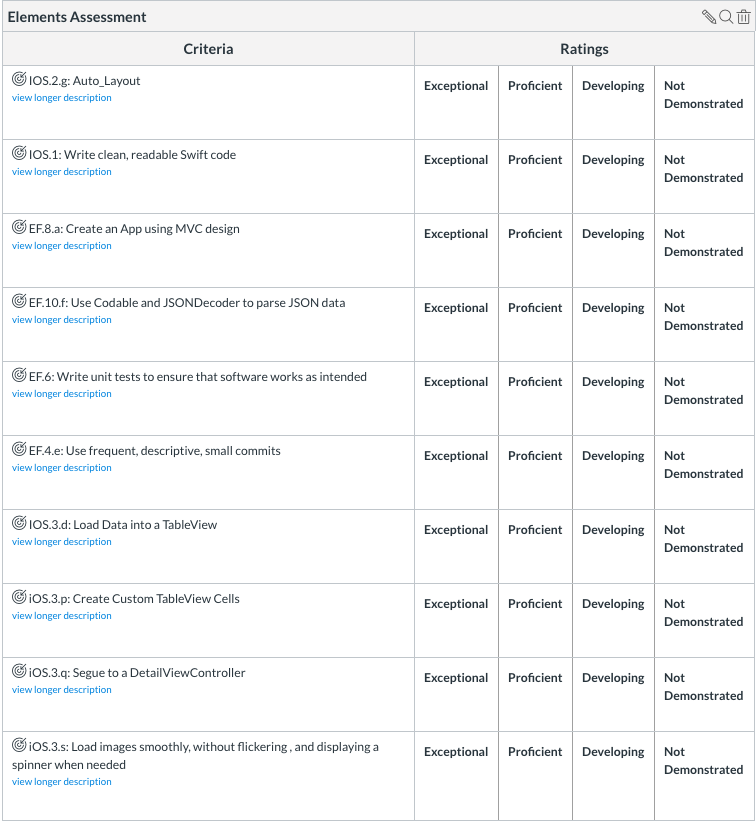

# Unit 3 Final - Elements

## Setup

1. Clone this repo to your laptop.
1. Create a branch for your project.
1. Work on the assessment as described below.
1. Commit your work.
1. Push it to your branch.
1. Create a pull request.
1. Submit your project to Canvas

## Helper classes we wrote 

<details>
	<summary>Network Helper - wrapper for URLSession</summary>

```swift
import Foundation

enum HTTPMethod: String {
    case get = "GET"
    case post = "POST"
}

class NetworkHelper {

    // MARK: - Static Properties

    static let manager = NetworkHelper()

    // MARK: - Internal Properties

    func performDataTask(withUrl url: URL,
                         andHTTPBody body: Data? = nil,
                         andMethod httpMethod: HTTPMethod,
                         completionHandler: @escaping ((Result<Data, AppError>) -> Void)) {
        var request = URLRequest(url: url)
        request.httpMethod = httpMethod.rawValue
        request.httpBody = body
        request.addValue("application/json", forHTTPHeaderField: "Content-Type")

        urlSession.dataTask(with: request) { (data, response, error) in
            DispatchQueue.main.async {
                guard let data = data else {
                    completionHandler(.failure(.noDataReceived))
                    return
                }

                guard let response = response as? HTTPURLResponse, (200...299) ~= response.statusCode else {
                    completionHandler(.failure(.badStatusCode))
                    return
                }

                if let error = error {
                    let error = error as NSError
                    if error.domain == NSURLErrorDomain && error.code == NSURLErrorNotConnectedToInternet {
                        completionHandler(.failure(.noInternetConnection))
                        return
                    } else {
                        completionHandler(.failure(.other(rawError: error)))
                        return
                    }
                }
                completionHandler(.success(data))
            }
            }.resume()
    }

    // MARK: - Private Properties and Initializers

    private let urlSession = URLSession(configuration: URLSessionConfiguration.default)

    private init() {}
}
```

</details>


<details>
	<summary>AppError - handles error throughout the app</summary>

```swift
import Foundation

enum AppError: Error {
    case unauthenticated
    case invalidJSONResponse
    case couldNotParseJSON(rawError: Error)
    case noInternetConnection
    case badURL
    case badStatusCode
    case noDataReceived
    case notAnImage
    case other(rawError: Error)
}
```

</details>


## Objective

* Build a table view that loads and displays a list of the Elements, one per cell/row. Use a custom UITableViewCell subclass.  It should have 2 labels and one image.  The image should be pinned to the left of cell from the small images endpoint below.  The labels should be configured as below:

    ```
    Name
    Symbol(Number) Atomic Weight

    e.g.

    Sodium
    Na(11) 22.989769282
    ```
    
    Load a thumbnail image on each row as described below under Endpoints > Images.  For full credit, use a custom tableViewCell to make the image more readable.
    
* Tapping a cell segues to a detail view that:
    * set the navigation bar title to the ```name``` of the element
    * shows the larger image 
    * and the following data:
        * symbol
        * number
        * weight
        * melting point
        * boiling point
        * discovery by

    * has a button that, when pressed, selects this element as your favorite. This
    should be implemented by a POST to the ```favorites``` endpoint.


Try to format the detail view as much like an individual element on a traditional periodic table as you can. You **cannot** use the thumbnail image inside the detail view controller, you need to format it yourself.

Sample element: [https://sciencenotes.org/wp-content/uploads/2015/04/06-Carbon-Tile.png](https://sciencenotes.org/wp-content/uploads/2015/04/06-Carbon-Tile.png)

## Endpoints

**Elements**

```
GET https://5c1d79abbc26950013fbcaa9.mockapi.io/api/v1/elements
```

This is a public read-only GET endpoint so no authentication is necessary.

**Images**

```
Thumbnail (for table view): http://www.theodoregray.com/periodictable/Tiles/{ElementIDWithThreeDigits}/s7.JPG
Example: http://www.theodoregray.com/periodictable/Tiles/018/s7.JPG

Full-size: (for detail view): http://images-of-elements.com/{lowercasedElementName}.jpg
Example: http://images-of-elements.com/argon.jpg
```

Use the file naming convention illustrated here to generate urls for images.

These are both http urls, so you will need change your info.plist to [allow arbitrary loads](https://stackoverflow.com/questions/31254725/transport-security-has-blocked-a-cleartext-http).

No full size images are available for atomic numbers 90 and up.

**Favorites**

```
POST https://5c1d79abbc26950013fbcaa9.mockapi.io/api/v1/favorites
```

This endpoint expects JSON with the following keys: "favoritedBy", "elementName" and "elementSymbol".
Values should be your own name, and the symbol and name of the element currently displayed by the detail page, respectively.

Using Postman and the endpoint below verify that you have favorited an element
```
GET https://5c1d79abbc26950013fbcaa9.mockapi.io/api/v1/favorites
```

## JSON Info

Elements looks like this:

```json 
    {
        "name": "Hydrogen",
        "appearance": "colorless gas",
        "atomic_mass": 1.008,
        "boil": 20.271,
        "category": "diatomic nonmetal",
        "color": null,
        "density": 0.08988,
        "discovered_by": "Henry Cavendish",
        "melt": 13.99,
        "molar_heat": 28.836,
        "named_by": "Antoine Lavoisier",
        "number": 1,
        "period": 1,
        "phase": "Gas",
        "source": "https://en.wikipedia.org/wiki/Hydrogen",
        "spectral_img": "https://en.wikipedia.org/wiki/File:Hydrogen_Spectra.jpg",
        "summary": "Hydrogen is a chemical element with chemical symbol H and atomic number 1. With an atomic weight of 1.00794 u, hydrogen is the lightest element on the periodic table. Its monatomic form (H) is the most abundant chemical substance in the Universe, constituting roughly 75% of all baryonic mass.",
        "symbol": "H",
        "xpos": 1,
        "ypos": 1,
        "shells": [
            1
        ]
    },
    {
        "name": "Helium",
        "appearance": "colorless gas, exhibiting a red-orange glow when placed in a high-voltage electric field",
        "atomic_mass": 4.0026022,
        "boil": 4.222,
        "category": "noble gas",
        "color": null,
        "density": 0.1786,
        "discovered_by": "Pierre Janssen",
        "melt": 0.95,
        "molar_heat": null,
        "named_by": null,
        "number": 2,
        "period": 1,
        "phase": "Gas",
        "source": "https://en.wikipedia.org/wiki/Helium",
        "spectral_img": "https://en.wikipedia.org/wiki/File:Helium_spectrum.jpg",
        "summary": "Helium is a chemical element with symbol He and atomic number 2. It is a colorless, odorless, tasteless, non-toxic, inert, monatomic gas that heads the noble gas group in the periodic table. Its boiling and melting points are the lowest among all the elements.",
        "symbol": "He",
        "xpos": 18,
        "ypos": 1,
        "shells": [
            2
        ]
    }
```

## Rubric




## Bonus 

Get all favorites endpoint
```
GET https://5c1d79abbc26950013fbcaa9.mockapi.io/api/v1/favorites
```

Embed your ElementsViewController in a Tab Bar controller that has 2 viewcontrollers that includes the ElementsViewController. The first view controller should display the Elements. The second view controller should display only the Elements you have favorited. (Hint: filter{} using favoritedBy: "Your name")
